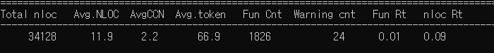
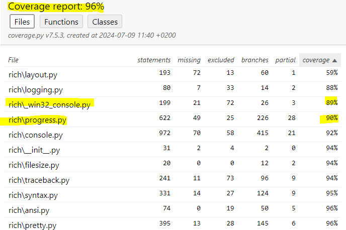
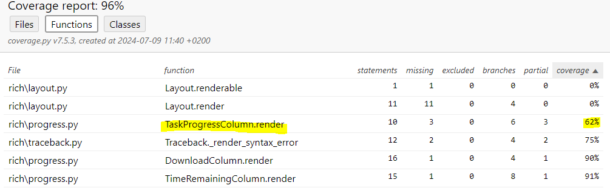
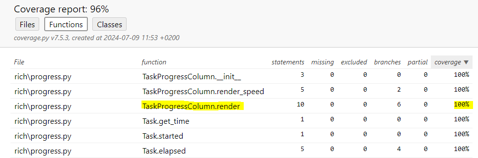
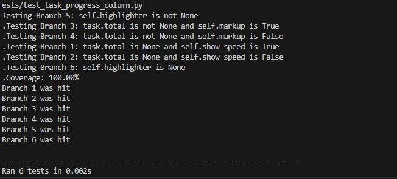
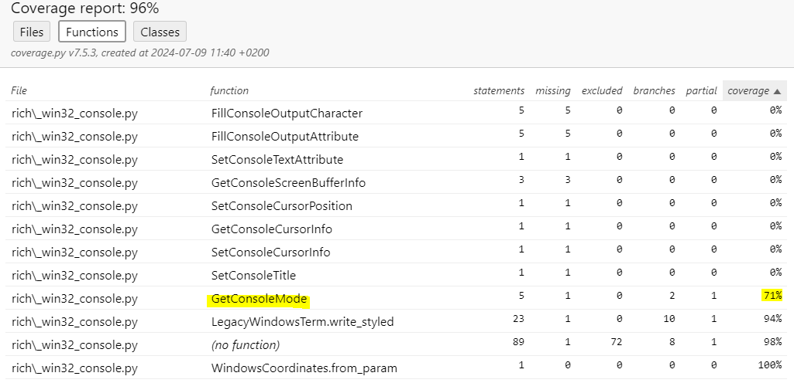
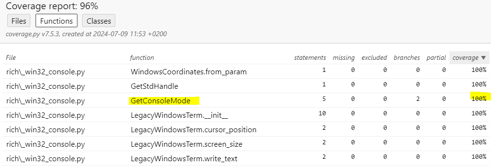
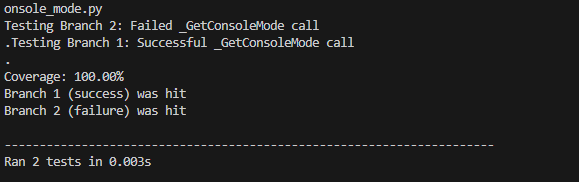

# Report for Assignment 1 resit

## Project chosen

Name: yujin choi

URL: (https://github.com/asdnng/rich)

Number of lines of code and the tool used to count it: Lizard

Programming language: python

## Coverage measurement with existing tool

<Inform the name of the existing tool that was executed and how it was executed>

Using Pytest : pytest --cov=rich --cov-branch tests/

<Show the coverage results provided by the existing tool with a screenshot>

## Coverage improvement

### Individual tests

<The following is supposed to be repeated for each function (2 in total)>

<Function 1>

<Show a patch (diff) or a link to a commit made in your forked repository that shows the new/enhanced tests for function 1>

-Commit : [testfile1](https://github.com/asdnng/rich/commit/122762ae410fc06131f007398d6f316530b1dd83#diff-ad4affc71f0175e1dc6ebdb47a0ff6bf70d56ff70b43a3a419432b1aab7c54ee)

<Provide a screenshot of the old coverage results for such function>

-Old coverage

<Provide a screenshot of the new coverage results for such function>

-New coverage

<State the coverage improvement with a number and elaborate on why the coverage is improved>

-Improvement with a number 

- The main reason for the improved coverage is that I added test cases and improved existing test cases to extend them to test all conditional branches. Previously, only some branches were tested, but I added test cases that could handle all input conditions so that each branch could be executed. So, coverage of the previous version was approximately 60%, after enhancement, I got 100% test coverage.

<Function 2>

<Show a patch (diff) or a link to a commit made in your forked repository that shows the new/enhanced tests for function 1>

-Commit : [testfile2](https://github.com/asdnng/rich/commit/122762ae410fc06131f007398d6f316530b1dd83#diff-28c0d3d128aa1c3706c46ddb13db19e3eeb4b25c5d04023fab2f1b6cf5acce26)

<Provide a screenshot of the old coverage results for such function>

-Old coverage

<Provide a screenshot of the new coverage results for such function>

-New coverage

<State the coverage improvement with a number and elaborate on why the coverage is improved>

-Improvement with a number 

  

-  This function also has 100% test coverage after enhancement after I added some additional test cases like the first one. Before the improvement, coverage of this function was 71%

### Overall

<Provide a screenshot of the old coverage results by running an existing tool (the same as you already showed at the beginning of the report)>

-Old coverage

  

<Provide a screenshot of the new coverage results by running the existing tool using all test modifications>

-New coverage

  

